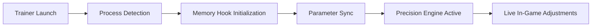

# 🎯 BALL x PIT Trainer – Dominate Every Arena with Precision

The **BALL x PIT Trainer** is a professional-grade performance enhancer built for competitive and high-speed gameplay. Whether you’re climbing the leaderboards or refining your reflex training, this software gives you complete control over physics, timing, and input sensitivity.

Built with adaptive tuning algorithms, the BALL x PIT Trainer lets you customize your gameplay for consistency, speed, and dominance — giving you the upper hand in every match.

---

## 🧩 Overview

The **BALL x PIT Trainer** enhances player control by offering precision-adjustable parameters and real-time training analytics. It’s designed for fast-paced competitive modes and offline skill practice, featuring:

* Custom aim acceleration and trajectory prediction.
* Momentum freeze and instant respawn options.
* Adaptive stamina, accuracy, and cooldown modifiers.
* Smart reaction-time analyzer and sensitivity profiling.

Ideal for PC players seeking to elevate muscle memory, consistency, and competitive balance.

---

## ⚙️ Key Features

### 🎮 Control & Reflex Modules

* Fine-tune aim assist and response curves.
* Enable “Perfect Timing” assists for jump, dash, and throw actions.
* Create dynamic hotkey profiles for switching between offense and defense modes.

### ⚡ Gameplay Enhancements

* Infinite stamina or cooldown bypass for uninterrupted drills.
* Unlock motion prediction overlays for shot optimization.
* Adjust world speed or gravity scale for simulation training.

```ini
[TrainerProfile]
AutoAim=True
AimSmoothing=0.85
CooldownBypass=True
GravityScale=0.95
SpeedMultiplier=1.3
```

> [!NOTE]
> Every setting can be customized per character, map, or training mode — ideal for tournament prep or creative sandbox play.

---

## 🧠 Adaptive Config System

The trainer’s **Adaptive Precision Engine (APE)** monitors input timing and dynamically adjusts assistance thresholds based on your playstyle.
If your reaction consistency improves, APE automatically reduces assist intensity — ensuring you’re training smarter, not relying on automation.

---

## 💻 Compatibility

| Platform           | Supported | Details                             |
| ------------------ | --------- | ----------------------------------- |
| Windows 11         | ✅         | Optimized DirectX 12 mode           |
| Windows 10         | ✅         | Stable build                        |
| Steam Version      | ✅         | Auto-detects game process           |
| Epic Games Version | ⚙️        | Manual directory selection required |
| Consoles           | ❌         | Unsupported                         |

> [!IMPORTANT]
> BALL x PIT Trainer requires **.NET 6 Runtime**, admin privileges, and at least **8GB RAM** for stability.

---

## ⚡ Setup & Installation

1. **Download** the BALL x PIT Trainer archive.
2. **Extract** all files to the root of your BALL x PIT directory.
3. Launch the game first, then run `BallXPitTrainer.exe`.
4. Press `F1` to open the in-game control panel.
5. Configure hotkeys, modules, and precision profiles.

Example command line:

```bash
BallXPitTrainer.exe --profile=competitive --autostart
```

> [!WARNING]
> Avoid running overlay tools (ReShade, MSI Afterburner) simultaneously — they may interfere with injection hooks.

---

## 🧭 Process Flow



This low-latency design ensures seamless feedback loops between user input and trainer effects.

---

## ❓ FAQ

**Q: Is the BALL x PIT Trainer safe to use?**
A: Yes, it’s an offline, standalone utility that does not interact with online servers or game data integrity systems.

**Q: Can I use multiple profiles?**
A: Absolutely — you can save unlimited `.ini` or `.json` configs for different maps, sensitivity levels, or roles.

**Q: Will it affect FPS?**
A: Minimal impact (<2%). The trainer is optimized for GPU-assisted overlay rendering.

**Q: How often is it updated?**
A: Updates roll out monthly with new balance patches, feature requests, and performance optimizations.

**Q: Is it compatible with controller input?**
A: Yes. Fully supports Xbox and DualSense mappings with adjustable input curves.

---

## 🏆 Why Players Choose BALL x PIT Trainer

* Precision-first performance enhancement.
* Fully modular configuration and adaptive intelligence.
* Safe for offline and practice environments.
* Backed by a growing PC competitive community.

---

## 🧩 Final Thoughts

The **BALL x PIT Trainer** pushes beyond standard enhancement tools — it’s a precision training suite built for serious competitors. Whether refining input accuracy or experimenting with custom physics, it ensures that every second of practice drives progress.

Train with intelligence. Play with control. Dominate with precision.

---

**BALL x PIT Trainer** – perfect your play, rule the arena.
